
<h1 align="center">企业在线培训系统+vue</h1>

## 简介
企业在线培训系统：角色分为管理员、讲师、员工；功能包括课程信息管理、话题讨论、考试管理、试题管理、个人中心、论坛管理、公告管理、课程收藏功能。    --计算机毕业设计源码；毕设源码；java毕业设计源码

## 联系方式

<h3 align="center">获取完整代码与数据库文件 + 微信：deepguan QQ: 86050149 QQ群: 783742310</h3>

<h3 align="center">可帮忙远程部署 包运行成功！提供远程部署、修改代码、设计文档指导、代码讲解等服务！</h3>

## 功能介绍（完整见运行截图）
管理员：提供登录、注册和退出功能，可通过导航栏管理课程信息、试题、公告及论坛帖子，支持试题编辑、考试管理、课程收藏及用户权限设置，包含添加、修改、删除和查看详细信息的功能，支持考试记录查询及论坛内容管理。

讲师：可登录系统并管理所授课程，包括上传课程资料、编辑课程内容及查看课程收藏信息，支持试题创建、修改与删除，以及试卷生成及考试安排，同时可以查看和回复话题讨论中的用户评论。

员工：提供登录、注册功能，登录后可访问首页导航栏选择课程学习、查看课程详情、收藏课程、参加在线考试、参与话题讨论、发布评论及查看公告信息，同时支持个人信息查看与修改。

游客：无需登录可浏览课程信息、公告及论坛帖子内容，但需注册后才能收藏课程、发表评论或参与在线考试，提供简单注册流程，支持角色选择为讲师或员工。

## 运行截图
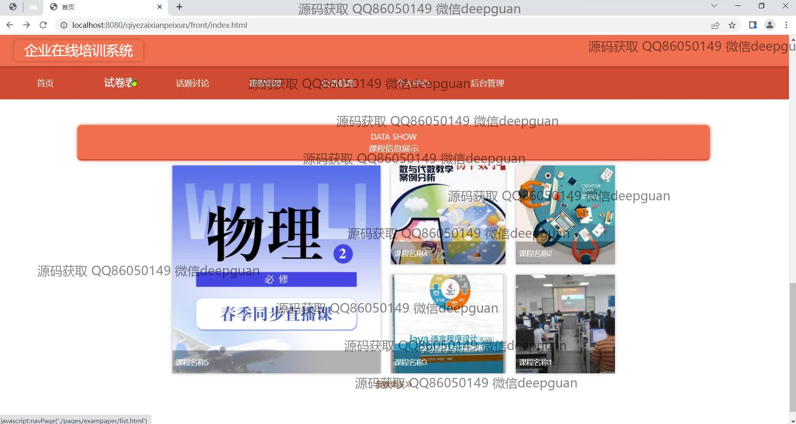
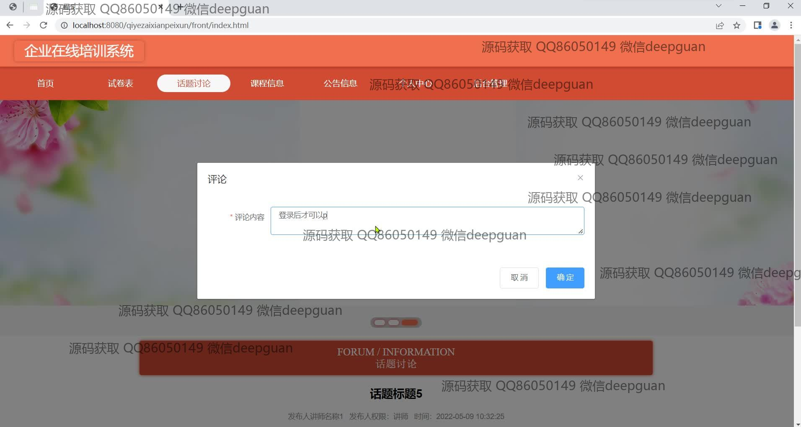
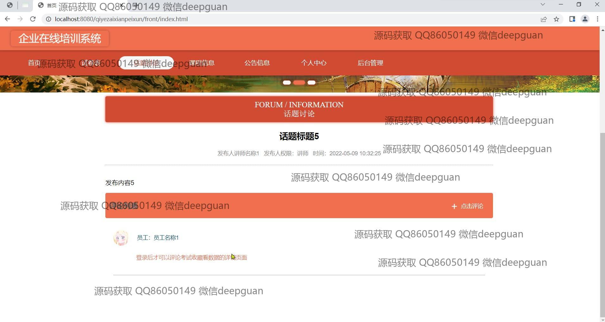
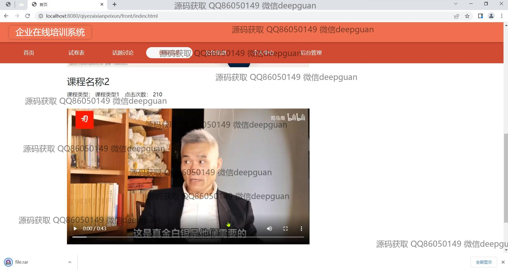
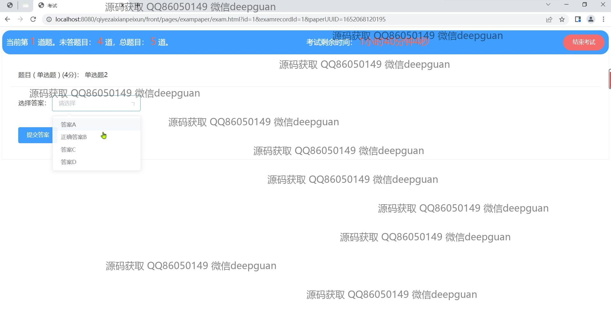
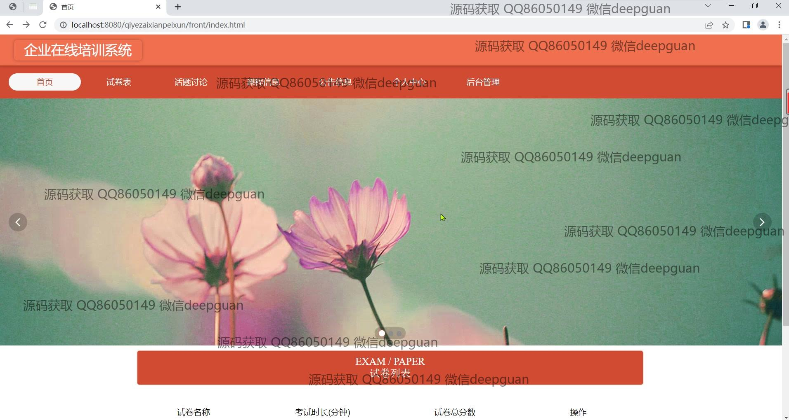
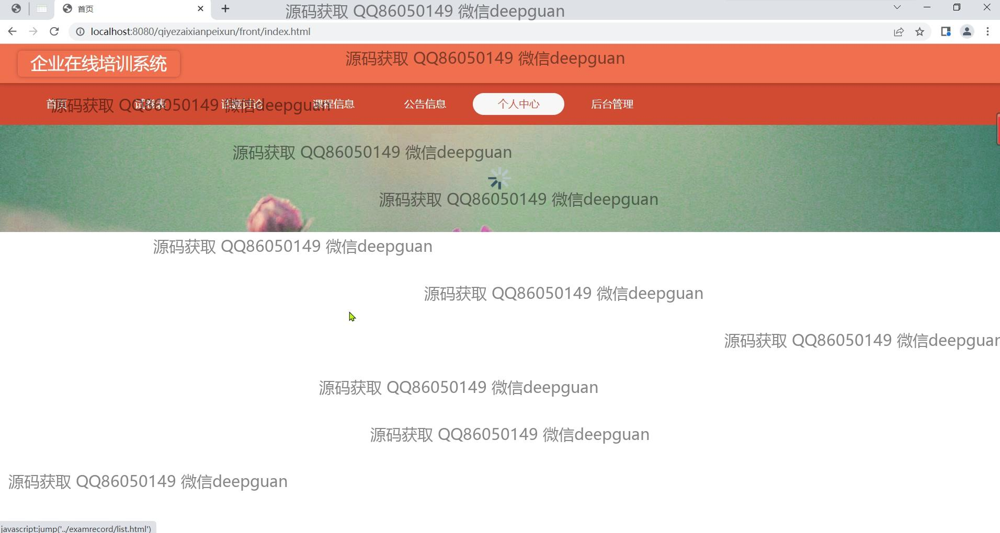
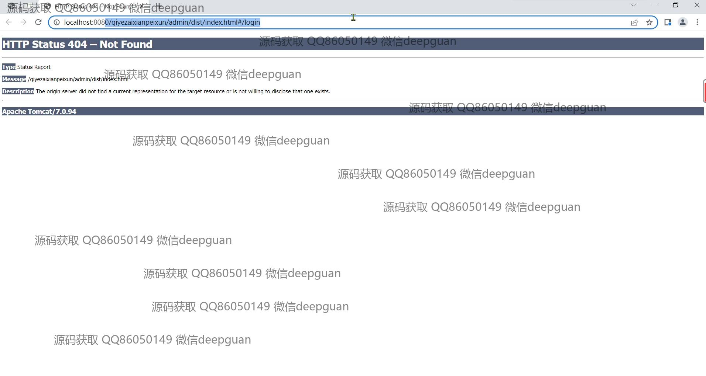
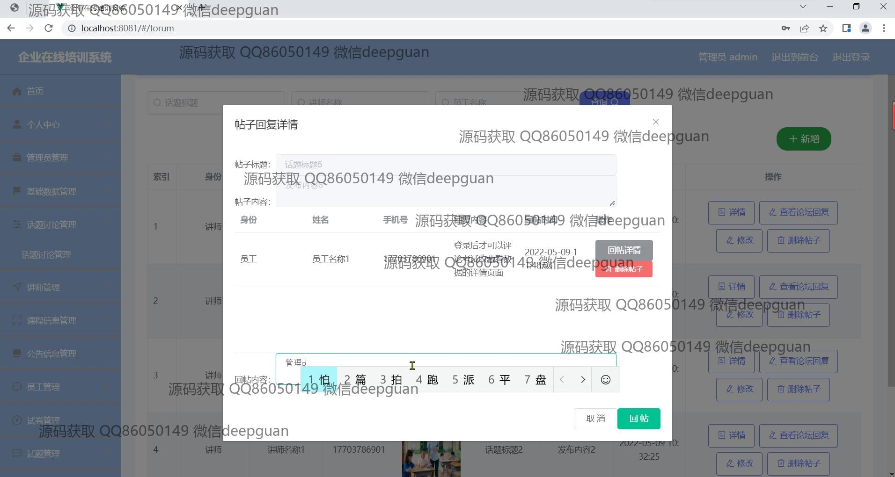
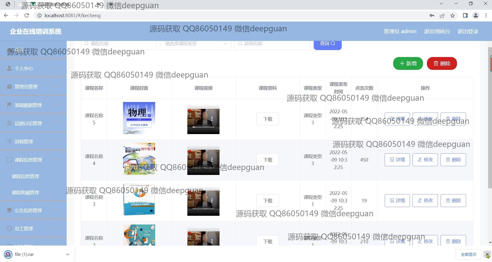
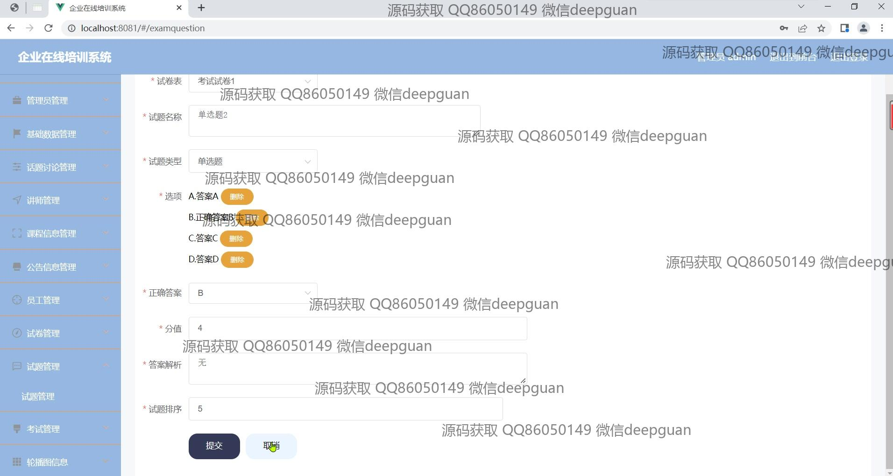
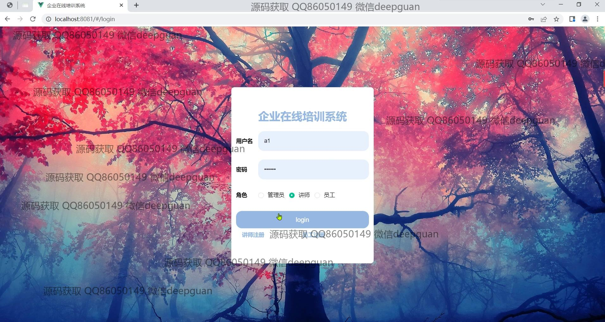
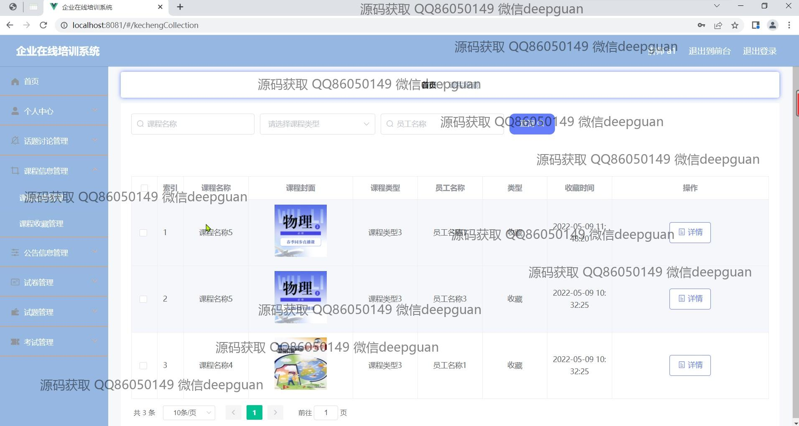
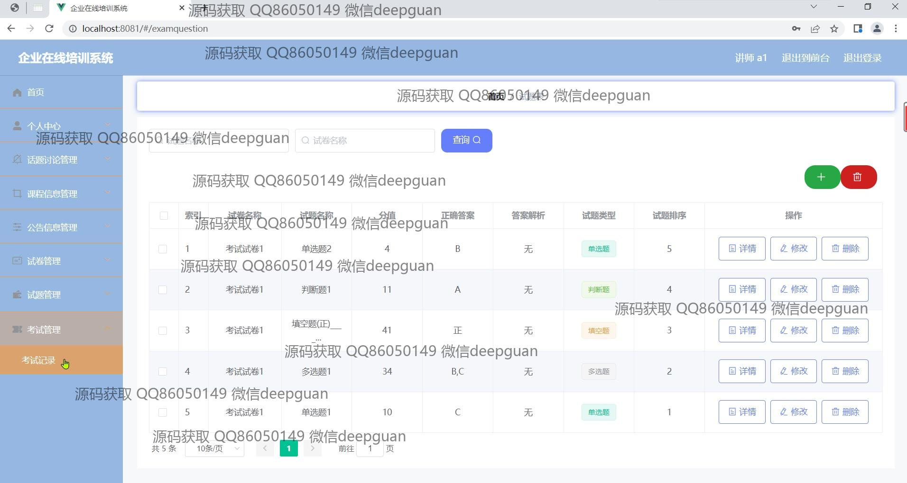
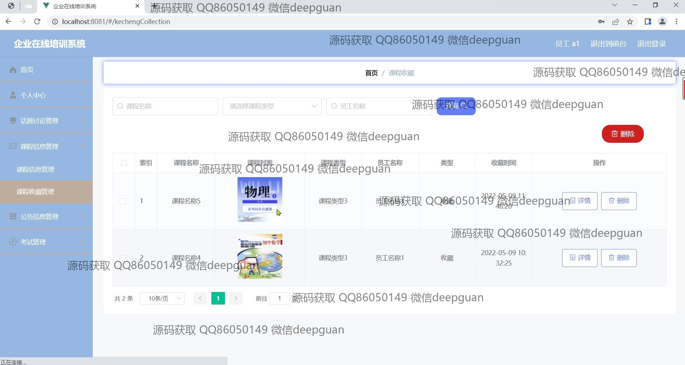

本代码来源于网络,仅供学习参考使用!

